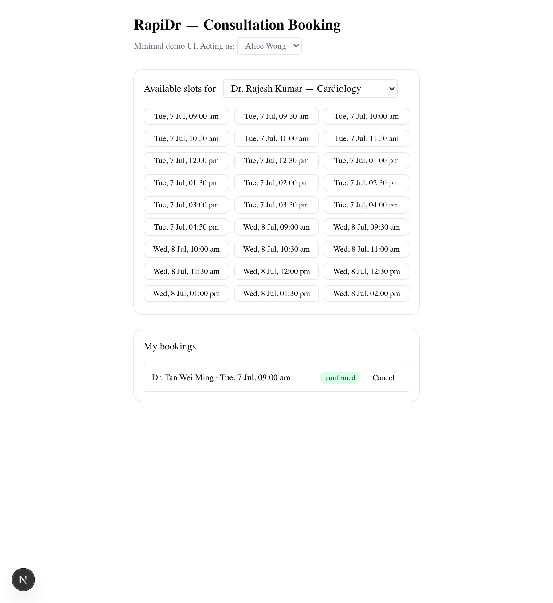

# RapiDr — Consultation Booking System

A simplified consultation-booking flow: patients view a doctor's available slots and book one. The engineering focus is **correctness under concurrency** — two requests racing for the same slot can never double-book — and an explicit, tested **booking state machine**.

> **Live demo:** https://rapidr-booking-assessment.vercel.app
> **Scope chosen:** Option 1, Consultation Booking System.



I've built booking systems in healthcare before — a 7-stage booking state machine for medical-equipment logistics at mymediset, and a medical appointment-booking assistant for my capstone. Two lessons from that work shaped this design: **booking state must be explicit and guarded** (silent invalid transitions are how real systems corrupt data), and **the "hold" is a first-class state** (a pending booking that never expires quietly blocks a slot forever). Both show up below.

---

## Quick start

Prerequisites: **Node ≥ 22**, **pnpm**, **Docker** (for local Supabase), and the **Supabase CLI**.

```bash
pnpm install
supabase start && supabase db reset   # boots local Postgres, applies schema + seed
pnpm dev                              # http://localhost:3000
```

`.env.local` and `.env.test` are **committed intentionally** (the brief asks for it) — they hold Supabase's well-known *local* demo credentials, identical on every machine, so a fresh clone runs with no setup.

> This project's local Supabase ports are remapped to `553xx` (in `supabase/config.toml`) so it coexists with other local Supabase projects. Studio: http://localhost:55323.

### Tests

```bash
pnpm test              # everything (47 tests)
pnpm test:unit         # domain state machine only — pure, no DB
pnpm test:integration  # booking/race/API — needs `supabase start` running
```

---

## Tech stack & why

| Layer | Choice | Reasoning |
|---|---|---|
| App | **Next.js (App Router, TS)** | One deployable for API + UI; instant Vercel deploy; the stack I use daily |
| Database | **PostgreSQL (Supabase)** | The double-booking guarantee is enforced *by Postgres* (a partial unique index), so it holds across any number of app instances |
| DB access | **`@supabase/supabase-js`** (server-only, service role) | My daily driver; invariants live in SQL migrations, not an ORM |
| Validation | **Zod** at the API boundary | Validate untrusted input at the edge; trust internal invariants |
| Tests | **Vitest** | Pure unit tests for the domain; integration tests against real local Postgres |
| UI | **React + Tailwind + shadcn/ui** | One deliberately-minimal page |

**Considered and rejected:** NestJS (heavier than this scope needs); an ORM like Prisma/Drizzle (adds a layer between the reviewer and the SQL that carries the correctness argument); a Turborepo monorepo (over-engineering for a single app).

---

## Architecture

```
src/
  domain/        # PURE. No I/O. Booking state machine + types. Unit-tested with zero DB.
  data/          # Supabase adapters (server-only): bookings, catalog, client.
  app/api/       # Thin route handlers: Zod-parse → call data/domain → map to HTTP.
  app/           # One-page booking UI (consumes only the public API).
  lib/           # Error envelope + shared route helper.
supabase/
  migrations/    # Schema owns the invariants (constraints, indexes, the availability view).
  seed.sql       # 3 doctors, 3 patients, ~2 weeks of 30-min slots.
```

Three layers, no ceremony. Business rules live only in `domain/` (pure, tested in isolation); invariants live only in Postgres; handlers just translate HTTP ↔ domain. It grows by adding modules, not by rewriting.

---

## The concurrency design (the core of this submission)

**Problem:** two patients request the same slot at the same instant. A check-then-insert in application code (`SELECT ... if free ... INSERT`) is a race — both reads see "free", both insert.

**Solution — make the invariant impossible to violate, at the storage layer:**

```sql
create unique index one_active_booking_per_slot
  on bookings (slot_id)
  where status in ('pending', 'confirmed');
```

At most one *active* (pending or confirmed) booking can exist per slot. Application code never checks-then-inserts; it **inserts and interprets the result** — a unique violation (`23505`) becomes `409 SLOT_TAKEN`. This is correct under any concurrency and any number of serverless instances, because Postgres itself is the single arbiter.

The race test proves it: **20 concurrent booking requests for one slot → exactly 1 succeeds, 19 get 409, exactly 1 active row exists.**

**Alternatives considered** (and why the index wins here):

- `SELECT … FOR UPDATE` in a transaction — works, but needs a transaction-capable connection path and holds row locks under load. Necessary once booking must be *atomic with side effects* (e.g. capturing payment in the same transaction) — not the case here.
- Advisory locks — same trade-off, more machinery.
- `SERIALIZABLE` isolation — pushes the problem to retry loops for something the index solves declaratively.

---

## Booking state machine

```
                     confirm                    complete (after slot ends)
       ┌─────────┐ ───────────► ┌───────────┐ ───────────► ┌───────────┐
book ─►│ PENDING │              │ CONFIRMED │              │ COMPLETED │
       └─────────┘ ───────────► └───────────┘              └───────────┘
          │   expire (10 min)         │
          │ cancel                    │ cancel (before slot starts)
          ▼                           ▼
      ┌───────────┐             ┌───────────┐
      │ CANCELLED │             │ CANCELLED │
      └───────────┘             └───────────┘
```

| From | Event | To | Guard |
|---|---|---|---|
| — | book | `pending` | slot exists, in the future, no active booking |
| `pending` | confirm | `confirmed` | hold not lapsed |
| `pending` | cancel | `cancelled` | — |
| `pending` | expire | `expired` | hold lapsed (system-applied, lazy) |
| `confirmed` | cancel | `cancelled` | before slot starts |
| `confirmed` | complete | `completed` | after slot ends |

Terminal: `cancelled`, `completed`, `expired`. Any other transition → `409`.

- The machine is a **pure function**, `transition(booking, event, now)` (`src/domain/transition.ts`) — the clock is a parameter, so all 25 cases (every row + guard boundaries) are unit-tested with no DB and no time-flakiness.
- Persistence applies the decision with **optimistic concurrency**: `UPDATE … WHERE status = <expected>`. If a concurrent transition already moved the row, zero rows update → `409 CONFLICT`. Racing confirm-vs-cancel can't corrupt state (there's a test for exactly that).

**The 10-minute hold + lazy expiry.** A `pending` booking holds the slot for 10 minutes (real clinics do this — "confirm to secure your slot"). Expiry is **lazy** (no cron): availability reads treat lapsed holds as free, and the booking path **reaps a lapsed hold before inserting** — an expired-but-unreaped `pending` row still occupies the partial index, so ordering matters. The two statements need no shared transaction: the index stays the single arbiter, and the worst race outcome is a spurious `409` (client retries), never a double-booking.

---

## API overview

Patient identity is passed via the **`x-patient-id`** header — a documented stand-in for real auth (see omissions).

| Method & path | Purpose | Notable responses |
|---|---|---|
| `GET /api/doctors` | List doctors | |
| `GET /api/doctors/:id/slots` | Available future slots for a doctor | |
| `GET /api/patients` | List patients (feeds the demo's patient switcher) | |
| `POST /api/bookings` | Book `{ slotId }` (+ optional `Idempotency-Key`) | `201`; `409 SLOT_TAKEN`; `422` past/unknown |
| `GET /api/bookings` | Current patient's bookings | |
| `POST /api/bookings/:id/confirm` | pending → confirmed | `409 HOLD_EXPIRED` / `INVALID_TRANSITION` |
| `POST /api/bookings/:id/cancel` | pending/confirmed → cancelled | `409 INVALID_TRANSITION` |
| `POST /api/bookings/:id/complete` | confirmed → completed | `409 TOO_EARLY_TO_COMPLETE` |

Errors use one envelope: `{ "error": { "code", "message" } }`, with codes mapped to HTTP status in one place (`src/lib/api.ts`).

```bash
# Book a slot (idempotent — retrying with the same key returns the same booking)
curl -X POST http://localhost:3000/api/bookings \
  -H 'content-type: application/json' \
  -H 'x-patient-id: 00000000-0000-0000-0000-0000000000a1' \
  -H 'idempotency-key: 11111111-1111-1111-1111-111111111111' \
  -d '{"slotId":"<a slot id from /api/doctors/:id/slots>"}'
```

---

## Race-condition tests (the bonus rubric item)

`tests/integration/booking-race.test.ts` and `transitions.test.ts` run against real local Postgres:

- **20 concurrent bookings, one slot → exactly 1 winner**, 19 × `SLOT_TAKEN`, 1 active row. (Verified stable across repeated runs.)
- **Expired hold → reaped + exactly one new winner** under a 10-way rebooking race.
- **Concurrent duplicate confirms** on one booking → exactly one applies; the rest are rejected by the conditional `UPDATE` (`CONFLICT`) or the state machine reading the already-confirmed row (`INVALID_TRANSITION`). (Optimistic concurrency.)
- **Idempotent retries** (sequential *and* concurrent, same key) → exactly one booking.
- Input guards: unknown slot, past slot, malformed body.

---

## Assumptions & deliberate omissions

Scoped out on purpose (the brief rewards a smaller, well-reasoned solution) — with how I'd do each in production:

- **Auth / RLS** — `x-patient-id` stands in. In production: Supabase Auth + row-level security (I've shipped this pattern). The service-role key stays server-side.
- **Doctor schedule recurrence** — slots are seeded concrete rows. Production: derive from weekly availability patterns + exceptions (recurrence, timezones).
- **Rescheduling** — modeled as `cancel` + `book`, not a new state.
- **Completion trigger** — an explicit `complete` endpoint (staff action). Production: a scheduled job after `ends_at`.
- **Payments, notifications, admin views, rate limiting, pagination** — out of scope.
- **Committed env vars** — intentional per the brief; a throwaway Supabase project, safe to expose and paused after review.

All times are stored as `timestamptz` and displayed in `Asia/Singapore`.

---

## What I'd do at 100× load

- **Read replicas** for availability queries (read-heavy); writes stay on primary.
- **Cache slot availability** with a short TTL — safe *because the unique index still guarantees correctness when the cache is stale*. The cache can lie; the arbiter can't.
- **Connection pooling** (Supavisor/pgBouncer) for serverless connection storms.
- **Move expiry to a sweep job** once notifications/analytics need eagerly-expired rows (lazy expiry is enough until then).
- **Partition `bookings` by time** as history grows; the active-booking index stays small.

---

## Deployment

Live on **Vercel** (app) + **Supabase cloud** (Postgres, Singapore region). The app reaches Supabase over its REST API, so the same booking/reap/insert logic runs unchanged in serverless.

**Env files (all committed, per the assessment's instructions — throwaway credentials only):**
- `.env.local` / `.env.test` → *local* Supabase, so `supabase start` gives a reproducible local run. This is the default for `pnpm dev` and the tests.
- `.env.production` → the *cloud* Supabase project (the one behind the live link). Next.js loads this for production builds; Vercel also has these set in its dashboard.

Note: the cloud `service_role` key is a throwaway (the project is paused after review). Committing a live-database key is not something I'd do outside an assessment that explicitly asks for it — in production this key would live only in the deployment platform's secret store.

---

## AI usage

I used Claude Code as a pair programmer. The **design spec** (`docs/specs/`) and **implementation plan** (`docs/plans/`) were written and committed *before* any code. Every architectural decision here is mine — DB-level uniqueness over application locking, the pending-with-expiry state, lazy reaping, the deliberate omissions.

Two examples of verifying rather than trusting the generated code:

1. An end-to-end smoke test surfaced that Zod v4's strict `.uuid()` rejects the readable sentinel IDs Postgres accepts fine — fixed with `z.guid()` (structural validation, matching the DB) and locked with a regression test.
2. A concurrency test I'd first written *asserted the wrong thing* — that racing `confirm` + `cancel` must leave exactly one winner. Reproducing it at raw SQL showed Postgres was correct; the flaw was my assumption: `cancel` is legal from `confirmed`, so an interleaved `pending→confirmed→cancelled` is a valid sequence, not a lost update. I rewrote it to test a genuine mutually-exclusive conflict (two concurrent `confirm`s).

The git history follows the six PRs.
